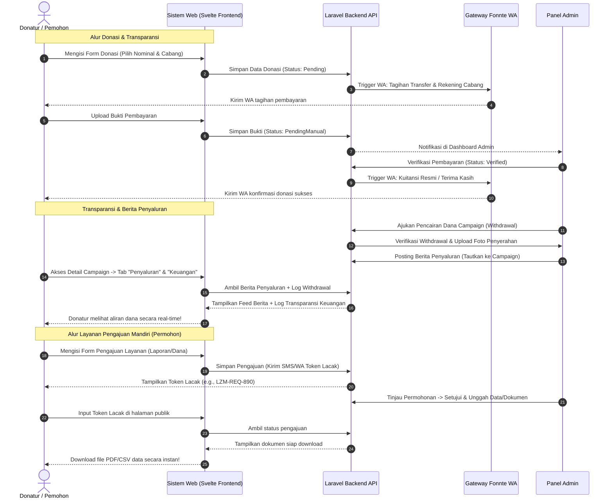

# Rencana Implementasi & Evaluasi Sistem Lazismu

Dokumen ini memuat analisis sistem saat ini, desain flow yang dioptimalkan, perbaikan bug krusial, penyesuaian fitur baru sesuai kebutuhan, analisis transisi Livewire ke Svelte, dan Test Plan komprehensif.

---

## 1. Rangkuman Sistem Saat Ini (Current System Summary)

Sistem ini adalah platform donasi dan manajemen keuangan multi-tenant single-database yang ditujukan untuk **Lazismu**. 

### A. Arsitektur Multi-Tenant
*   **Tenancy Scoping:** Menggunakan trait `BelongsToMasjid` yang secara otomatis menerapkan *global query scope* pada model-model utama (seperti `Campaign`, `Donation`, `Withdrawal`, `BlogPost`, `Muzakki`, `Mustahik`).
*   **Tenant Entity:** Saat ini disimbolkan oleh model `Masjid` (tabel `masjids`).
*   **Scope Resolution:** Mengambil `active_masjid_id` dari session (untuk admin/super-admin) atau `masjid_id` milik user yang terautentikasi. Jika berada di public/guest context, sistem mewarisi data dari Pusat (Pusat ID = `1`).

### B. Fitur Utama Platform
1.  **Campaign Management:** Pengelolaan program donasi (kategori, target nominal, urgensi, batas waktu/tenggat).
2.  **Donation Flow:** Alur donasi melalui `DonateWizard` (Livewire Component 3 langkah: Nominal & Cabang -> Profil Donatur -> Metode Pembayaran).
3.  **Payment Verification:** Mendukung Transfer Bank Manual (memerlukan unggah bukti transfer) dan QRIS Otomatis. Donasi ditandai `Pending` -> `PendingManual` (setelah upload bukti) -> `Verified` (setelah disetujui admin).
4.  **Financial & Disbursement:** Penyaluran dana melalui modul `Withdrawal` yang mencatat jumlah penyaluran, mustahik penerima, distributor, deskripsi, dan foto bukti penyaluran.
5.  **Master Data:** Pengelolaan data Muzakki (Donatur), Mustahik (Penerima Manfaat), dan Distributor (Penyalur).

---

## 2. Penyesuaian Fitur Baru Berdasarkan Kebutuhan

### Note 1: Mempermudah Pemohon Meminta Data dari Sistem (Layanan Pengajuan)
*   **Masalah:** Saat ini tidak ada portal mandiri bagi penerima manfaat (mustahik) atau cabang untuk mengajukan data bantuan atau laporan secara resmi.
*   **Solusi:**
    1.  **Portal Pengajuan Publik (Layanan Mandiri):** Halaman publik `/pengajuan` di mana pemohon (individu/lembaga) dapat mengajukan permohonan data (misal: laporan donasi spesifik, sertifikat muzakki) atau pengajuan dana bantuan secara mandiri.
    2.  **Tracking System:** Pemohon memasukkan nomor telepon dan menerima *Request Token* untuk melacak status pengajuan secara real-time (`Pending` -> `Diproses` -> `Selesai` / `Ditolak`).
    3.  **Data Export Segera:** Tombol "Unduh Ringkasan" cepat pada halaman detail pengajuan yang disetujui untuk mengunduh dokumen secara langsung (PDF/CSV).

### Note 2: Import CSV (Muzakki, Mustahik, Donasi)
*   **Masalah:** Memasukkan data satu per satu memakan waktu lama bagi admin.
*   **Solusi:**
    1.  Membuat Livewire Component `Admin.CsvImporter` yang dapat diletakkan di halaman index Muzakki, Mustahik, dan Donasi.
    2.  Menyediakan template CSV resmi yang dapat diunduh langsung oleh admin.
    3.  **Validasi Importer:** Validasi tipe data, deteksi duplikasi berdasarkan nomor telepon/email, normalisasi nomor telepon otomatis, serta transaksi basis data yang aman (menggunakan database transaction, sehingga jika ada 1 baris gagal, seluruh proses di-rollback untuk mencegah kerusakan data partial).

### Note 3: Integrasi Fonnte (WhatsApp Gateway)
*   **Masalah:** Donatur tidak mendapatkan notifikasi instan setelah donasi dibuat atau diverifikasi, mengurangi transparansi.
*   **Solusi:**
    1.  Membuat `App\Services\Notification\WhatsappService` dengan driver Fonnte (`https://api.fonnte.com/send`).
    2.  Menyimpan token Fonnte di `.env` (`FONNTE_API_TOKEN`) dan memetakannya ke `config/services.php`.
    3.  **Trigger Otomatis:**
        *   **Donasi Dibuat:** Mengirim instruksi transfer ke nomor WhatsApp donatur ("Terima kasih [Nama]! Silakan transfer Rp [Nominal] ke rekening [Bank] [NoRek]. Unggah bukti transfer di: [LinkStatus]").
        *   **Donasi Terverifikasi:** Mengirim tanda terima resmi ("Alhamdulillah! Donasi Anda sebesar Rp [Nominal] untuk program [Campaign] telah diverifikasi. Semoga menjadi amal jariyah.").
        *   **Penyaluran (Withdrawal) Selesai:** Mengirim notifikasi transparansi ke grup Muhammadiyah/masjid setempat.

### Note 4: Cabang/Tenant Fleksibel (Tidak Harus Masjid)
*   **Masalah:** Database saat ini sangat terikat dengan istilah `Masjid` (tabel `masjids`, kolom `masjid_id`, dll.). Jika dipaksa mengubah nama tabel dan kolom di 35 tabel, risikonya sangat tinggi (data loss, query rusak).
*   **Solusi (Database Safe & UI Agnostic):**
    1.  **Skema database tetap menggunakan `masjids` dan `masjid_id`** untuk menjaga kompatibilitas backward dan mencegah penulisan ulang migrasi.
    2.  Menambahkan kolom `type` pada tabel `masjids` melalui migrasi baru:
        ```php
        $table->string('type')->default('masjid'); // masjid, cabang_muhammadiyah, ranting_muhammadiyah, lembaga, mitra
        ```
    3.  Pada level **User Interface (UI)**, ganti seluruh label dari "Masjid" menjadi **"Cabang / Unit Penyalur"** atau **"Tenant/Lembaga"** secara dinamis berdasarkan nilai `type` dari unit tersebut.

### Note 5: Laporan Berita Penyaluran Donasi di Halaman Detail Donasi/Campaign
*   **Masalah:** Donatur tidak tahu dana yang terkumpul disalurkan ke mana saja secara transparan pada program yang mereka pilih.
*   **Solusi (Tabbed Transparency Interface):**
    Di halaman `/program/{slug}` publik, tambahkan sistem Tab:
    1.  **Tab 1: Deskripsi Program** (Isi detail campaign saat ini).
    2.  **Tab 2: Berita Penyaluran (News Feed):** Menambahkan foreign key `campaign_id` (nullable) pada tabel `blog_posts`. Admin dapat menulis blog/berita penyaluran (lengkap dengan foto kegiatan) dan menandainya ke program tertentu. Berita tersebut otomatis tampil sebagai timeline berita di halaman detail program.
    3.  **Tab 3: Transparansi Keuangan (Withdrawal Log):** Menampilkan daftar penarikan dana/penyaluran terverifikasi dari tabel `withdrawals` yang berelasi dengan `campaign_id` (nominal, tanggal, nama distributor, mustahik penerima, deskripsi, dan foto bukti penyerahan uang).

### Note 6: Disable Tombol Donasi Jika Tenggat Waktu Lewat
*   **Masalah:** Saat ini tombol donasi tetap aktif atau program disembunyikan seluruhnya.
*   **Solusi:**
    1.  Pada `guest/campaigns/show.blade.php`, jika campaign telah berakhir (`end_date` sudah terlewati atau target dana tercapai), **tombol donasi TIDAK disembunyikan** melainkan **di-disabled** dengan tampilan warna abu-abu elegan dan teks `Tenggat Waktu Habis` atau `Program Telah Ditutup`.
    2.  Menambahkan validasi ketat di backend (`DonateWizard` mount dan `DonationService::create`) untuk memblokir permintaan donasi jika tenggat telah lewat.

---

## 3. Laporan Temuan Bug & Error Saat Ini (Bug & Error Report)

Setelah melakukan audit mendalam terhadap kode sumber yang ada, ditemukan beberapa bug krusial yang dapat merusak aplikasi atau menyebabkan crash di lingkungan production:

### Bug 1: Syntax Error Krusial pada Validasi Telepon (Fatal Parse Error)
*   **Lokasi:** `app/Services/Donation/DonationService.php` baris 186:
    ```php
    return ! preg_match(`/^(\+62|62|0)[0-9]{9,12}$/`, $phone);
    ```
*   **Analisis Bug:** Penggunaan tanda backtick (`` ` ``) untuk membungkus regex dalam parameter `preg_match` adalah **kesalahan sintaksis fatal** di PHP. PHP akan mencoba mengeksekusi ekspresi regex tersebut sebagai perintah shell (shell execution) dan melempar `ParseError` atau `Fatal error`, sehingga validasi donasi selalu gagal/crash.
*   **Perbaikan:** Harus dibungkus dengan single quote (`'`) atau double quote (`"`):
    ```php
    return ! preg_match('/^(\+62|62|0)[0-9]{9,12}$/', $phone);
    ```

### Bug 2: Null Pointer Crash pada Batas Waktu Campaign Berkelanjutan
*   **Lokasi:** `app/Models/Campaign.php` baris 153-157:
    ```php
    public function canReceiveDonations(): bool
    {
        return $this->status->canReceiveDonations()
            && $this->end_date->isFuture();
    }
    ```
*   **Analisis Bug:** Jika program bersifat berkelanjutan (*ongoing campaign*), maka kolom `end_date` akan bernilai `null`. Memanggil method Carbon `isFuture()` pada nilai `null` akan memicu error fatal: `"Call to a member function isFuture() on null"`.
*   **Perbaikan:** Tambahkan pengecekan null terlebih dahulu:
    ```php
    public function canReceiveDonations(): bool
    {
        return $this->status->canReceiveDonations()
            && (is_null($this->end_date) || $this->end_date->isFuture());
    }
    ```

### Bug 3: Kebocoran Tenant Data (Data Leakage) Akibat Evaluasi Session Global Scope
*   **Lokasi:** `app/Traits/BelongsToMasjid.php` baris 27-34:
    ```php
    if (request()->is('admin*') || request()->is('manage*') || auth()->check()) {
        $builder->where($builder->getQuery()->from.'.masjid_id', $activeId);
    }
```
*   **Analisis Bug:** Logika `auth()->check()` digunakan untuk menentukan context Admin. Namun, jika seorang admin sedang login lalu **membuka halaman guest/publik publik**, `auth()->check()` akan tetap bernilai `true`. Akibatnya, query halaman publik untuk admin tersebut ikut terkunci hanya pada unit/masjid miliknya saja, bukannya menampilkan data dari seluruh cabang (tidak bisa melihat campaign dari cabang lain secara default di publik).
*   **Perbaikan:** Hapus `auth()->check()` dari conditional context admin, cukup gunakan deteksi URL prefix admin:
    ```php
    if (request()->is('admin*') || request()->is('manage*')) {
        $builder->where($builder->getQuery()->from.'.masjid_id', $activeId);
    }
    ```

---

## 4. Rancangan Flow Baru yang Lebih Baik (Optimized System Flow)

Mengabaikan keterbatasan sistem yang ada saat ini, berikut adalah flow baru yang dirancang untuk menjamin transparansi tinggi, kemudahan pengajuan data, serta otomatisasi notifikasi WhatsApp:



---

## 5. Analisis Transisi ke Svelte (Inertia.js + Svelte vs Livewire)

Untuk mengatasi beban server yang berat akibat Livewire (yang melakukan full re-evaluation framework, serialisasi state, re-rendering HTML di server, dan pertukaran payload HTML besar untuk setiap interaksi kecil), transisi ke **Inertia.js + Svelte** adalah solusi terbaik.

### Perbandingan Beban Server & Performa

| Parameter | Livewire / Volt (Saat Ini) | Svelte + Inertia.js (Direkomendasikan) | Dampak bagi Server & Pengguna |
| :--- | :--- | :--- | :--- |
| **Lokasi Rendering UI** | **Server-side (CPU Server)** | **Client-side (Browser Donatur)** | Mengurangi beban CPU server hingga **60-70%** karena server tidak perlu merender HTML pada setiap interaksi. |
| **Ukuran Payload Interaksi**| Besar (Mengirim potongan HTML ter-render) | Sangat Kecil (Hanya JSON data murni) | Menghemat bandwidth server, loading interaksi terasa instan bagi donatur (kurang dari 100ms). |
| **Manajemen State** | Server-side (Dikirimi balik terus menerus) | Client-side (Lokal di memori browser) | Mencegah bottleneck memori server saat ribuan donatur membuka form donasi bersamaan. |
| **Ketergantungan Server** | Tinggi (Setiap ketukan tombol memicu request) | Rendah (Request hanya dikirim saat submit data) | Aplikasi tetap responsif secara lokal bahkan pada koneksi internet donatur yang lambat. |

### Roadmap Migrasi Bertahap (Tanpa Merusak Sistem Saat Ini)
1.  **Tahap 1: Instalasi Inertia & Svelte:** Install package `inertiajs/inertia-laravel` dan setup bundler Vite dengan plugin Svelte.
2.  **Tahap 2: Migrasi Halaman Publik Terlebih Dahulu (Prioritas Utama):** Migrasikan halaman publik yang paling sering diakses (Home, Detail Program, dan `DonateWizard`) ke Svelte untuk menurunkan beban server secara signifikan dari lalu lintas publik.
3.  **Tahap 3: Migrasi Halaman Dashboard Admin secara Bertahap:** Mengubah Volt component di admin panel menjadi Inertia Svelte component secara bertahap dimulai dari form-form berat seperti Importer CSV dan Verifikasi Donasi.

---

## 6. Test Plan Komprehensif (Pest 4 Test Suite)

Guna memastikan kestabilan sistem setelah perbaikan bug dan penambahan fitur baru, berikut adalah Test Plan komprehensif menggunakan **Pest 4** yang mencakup pengujian unit, integrasi, multi-tenancy, dan skenario kegagalan:

### A. Skenario Uji 1: Multi-Tenancy Isolation (Unit & Integration)
*   **Tujuan:** Memastikan data donasi, campaign, dan settings terisolasi sempurna antar cabang (tenant) dan tidak bocor ke unit lain.
*   **Daftar Test Case:**
    *   `it('scopes campaigns query to current active tenant')` -> Membuat Campaign di Tenant A dan Tenant B, pastikan query Tenant A hanya mengembalikan milik A.
    *   `it('inherits Pusat campaigns in public context when active tenant is defined')` -> Memastikan publik dapat melihat campaign Pusat (ID 1) dan campaign milik Tenant aktif.
    *   `it('does not leak settings across different tenants')` -> Memastikan config akun bank Tenant A tidak muncul di wizard pembayaran Tenant B.
    *   `it('avoids data leakage when admin session changes active tenant')` -> Mengubah `active_masjid_id` di session dan memastikan seluruh dashboard admin memuat data baru secara presisi.

### B. Skenario Uji 2: Integrasi Fonnte WhatsApp Gateway (Unit & Mocking)
*   **Tujuan:** Memastikan notifikasi terkirim dengan format data yang tepat dan tidak menghambat proses donasi jika API Fonnte mengalami error/timeout.
*   **Daftar Test Case:**
    *   `it('normalizes donor phone number to international format')` -> Memastikan input nomor telepon `081234...` dikonversi menjadi `+6281234...` secara presisi.
    *   `it('queues WhatsApp notification and does not block database transaction')` -> Menguji bahwa notifikasi WA dikirim melalui Laravel Queue (`ShouldQueue`), sehingga performa donasi tetap cepat.
    *   `it('sends pending payment notification to donor via Fonnte service')` -> Melakukan mock API call Fonnte dan memastikan payload JSON berisi pesan instruksi pembayaran yang benar.
    *   `it('sends verified receipt notification when admin approves donation')` -> Meniru verifikasi donasi oleh admin dan memverifikasi pengiriman WA terima kasih dipicu.
    *   `it('gracefully handles Fonnte API failure without breaking checkout flow')` -> Mensimulasikan Fonnte API offline (HTTP 500), memastikan transaksi donasi donatur tetap sukses tersimpan di database.

### C. Skenario Uji 3: Deadline & Target Dana Campaign (Integration)
*   **Tujuan:** Menguji keakuratan penutupan program donasi secara otomatis ketika waktu berakhir dan menonaktifkan tombol donasi.
*   **Daftar Test Case:**
    *   `it('disables donation button in blade when end date has passed')` -> Memastikan method view-rendering mendeteksi tenggat waktu lewat dan menghasilkan button dengan atribut `disabled`.
    *   `it('blocks donation submission in backend if campaign is expired')` -> Memaksa kiriman donasi melalui API ke campaign kedaluwarsa dan memastikan melempar RuntimeException.
    *   `it('allows ongoing campaigns with null end date to receive donations continuously')` -> Memastikan campaign tanpa `end_date` tidak crash (menguji perbaikan Bug 2) dan sukses menerima donasi.

### D. Skenario Uji 4: CSV Importer Component (Integration)
*   **Tujuan:** Memvalidasi keandalan impor massal data Muzakki, Mustahik, dan Donasi tanpa menimbulkan data duplikat atau corrupt.
*   **Daftar Test Case:**
    *   `it('validates CSV format and header columns strictly')` -> Mengunggah file CSV sampah/tidak sesuai format dan memastikan sistem menolak dengan pesan error valid.
    *   `it('rejects duplicate muzakki during import based on email or phone')` -> Mengimpor CSV dengan record yang sudah ada di database, memastikan data tidak terduplikasi.
    *   `it('rolls back database transaction if any single row in CSV contains invalid data')` -> Mengimpor 10 data di mana baris ke-8 corrupt (amount huruf), memastikan 7 data sebelumnya dibatalkan penyimpanannya (integrity lock).

### E. Skenario Uji 5: Svelte Inertia Endpoint Assertions (API Integration)
*   **Tujuan:** Menjamin kestabilan endpoint API ketika frontend dimigrasikan ke Svelte menggunakan Inertia.
*   **Daftar Test Case:**
    *   `it('returns correct Inertia JSON response structure for campaigns index')` -> Memeriksa header request Inertia dan memastikan respons payload berisi list campaign murni tanpa markup HTML.
    *   `it('validates request schema on donation submit endpoint')` -> Menguji validasi form donasi dari Svelte ke controller Inertia mengembalikan data error HTTP 422 dengan pesan lengkap.
